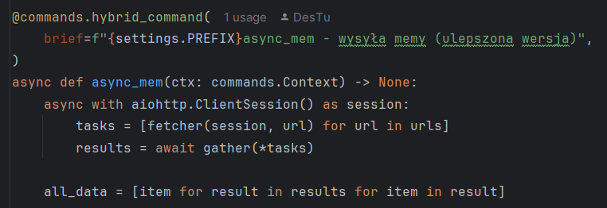
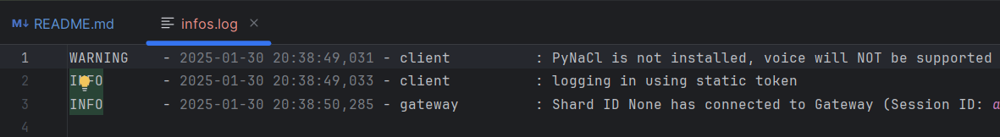
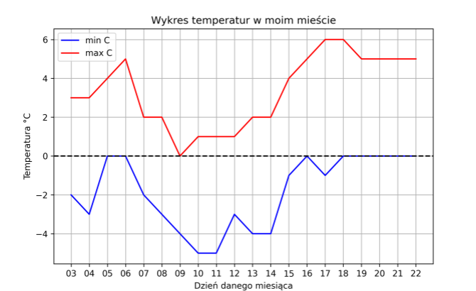

## import discord.py
The Discord bot is written in discord.py. The bot is optimized for dynamically managing commands and performing various actions within a Discord server.

## from bs4 import BeautifulSoup & import requests
Automatically sends a message to the selected Discord channel and inserts specific information there.

## import asyncio & import aiohttp
It is worth noting that aiohttp and asyncio work great together for scraping data from multiple websites at once.

## from logging.config import dictConfig & import logging
When hosting a bot, we keep information about bot errors in the infos.log file. 

## import matplotlib.pyplot as plt & import io
Some data can be stored in a graph, sent as a temporary file io.BytesIO().

## import re
The bot uses regex to detect suspicious links posted in public Discord channels.

